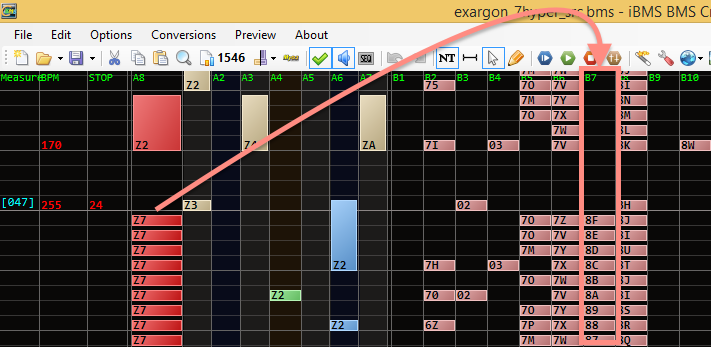
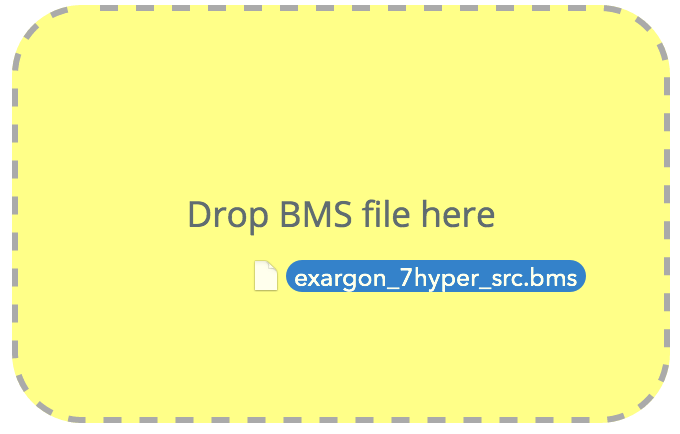
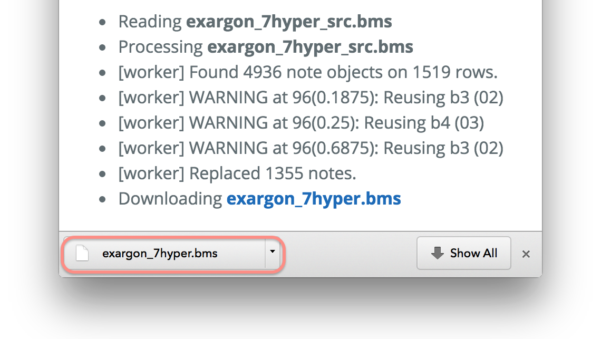
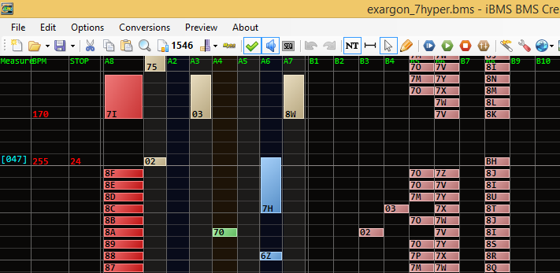

BMS Sound Matcher <small>by flicknote</small>
============

  

    

      Loading...
    

  

  

    <ul id="bc-output">
      <li>Please drop a BMS file into the dropzone at the left.</li>
    </ul>
  

---

About
-----

BMS Sound Matcher lets you create note patterns more comfortably
by matching notes and BGM objects.
__See the tutorial below to understand how.__

How to use?
-----------

  

    

      
    

    

      <strong>1.&nbsp; Create your pattern using Z1, Z2, Z3, … objects.</strong>
    

    
For example, Z1 corresponds to 1st BGM track. Z2 corresponds to 2nd BGM track, and so on.

  

  

     
    
<strong>2.&nbsp; Drop the BMS file into this application.</strong>

    
After you drop the BMS file, this application will process the BMS
      and matches the notes object with corresponding BGM keysound objects.

  

  

    

      
    

  

  

    

      
    

  

  

     
    
<strong>3.&nbsp; Download the generated BMS file.</strong>

    
After processing is finished, your browser will download the generated BMS file.

  

  

    

      
    

    

      <strong>4.&nbsp; Your BMS is now keysounded!</strong>
    

    

      That's it! No more dragging notes around to create a pattern.
    

  

Limitations
-----------

- Objects __Z1__–__ZZ__ are reserved. You cannot use it in musical score.
- Supports Chrome 42 and Firefox 37.

Technical Information
---------------------

- The worker is written in Ruby, compiled into JavaScript using [Opal](http://opalrb.org/).
- [Offline version is available](https://github.com/bemusic/bms-tools/tree/master/bms-compiler) as a Ruby command-line script.

